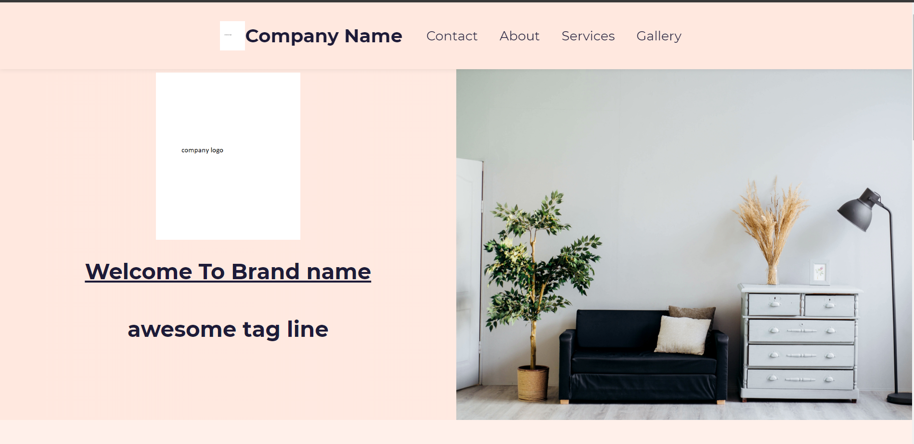
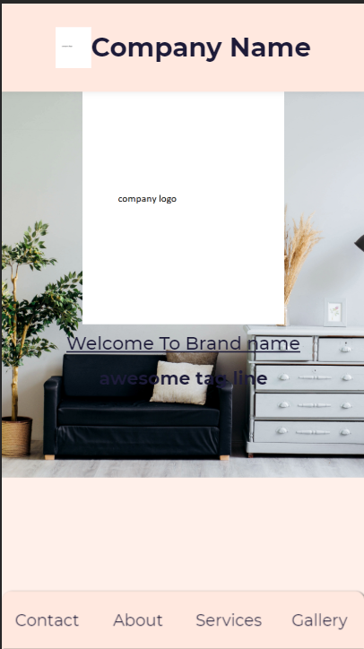

# A portfolio website for a company.




A nice example of how to start working with react.

## Getting Started

These instructions will get you a copy of the project up and running on your local machine for development and testing purposes. See deployment for notes on how to deploy the project on a live system.

### Installing

Clone the Repository and run

```
npm install

npm start
```

## Built With

- [React JS](https://reactjs.org/)
- [React Router](https://github.com/ReactTraining/react-router)
- [Styled Components](https://www.styled-components.com)
- [GSAP](https://greensock.com/gsap/)

## Project Status

- **Completed**

## Authors

- **Soham Singh Yadav** - _Development_ - [SohamSingh](https://github.com/sohamsingh29)

## License

[MIT](https://choosealicense.com/licenses/mit/)
